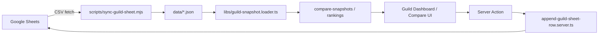

# 아키텍처

meki-guild `apps/web`의 라우트·레이어·데이터 흐름을 정리합니다.

## 라우트 맵

| 경로             | 역할                                          |
| ---------------- | --------------------------------------------- |
| `/`              | 사이트 허브 (길드 / 팁 진입)                  |
| `/guild`         | 길드 대시보드 (게이트 + 실명 마스킹 레이아웃) |
| `/guild/compare` | 길드원 1 vs 1 비교                            |
| `/tips`          | 정보·팁 허브                                  |
| `/tips/*`        | 개별 팁 (동료·유물·스테이지·던전·명중컷 등)   |
| `/updates`       | 사이트 업데이트 일지                          |

`app/api` 라우트는 없습니다. 데이터는 RSC + Server Actions + 정적 JSON으로 처리합니다.

## 레이어

```text
app/                    # 라우트·metadata. loader만 호출
features/<domain>/
  sections/             # 페이지 본문 조합
  components/           # 도메인 UI
  lib/                  # feature 전용 로직·action·*.server.ts
  types/                # *.type.ts
  context/              # 클라이언트 컨텍스트 (예: 실명 공개)
components/             # 앱 공통 UI (header, PageShell, …)
libs/                   # 도메인 상수·loader·서버 헬퍼
utils/                  # 순수 헬퍼 (날짜·한국어 숫자 포맷)
data/                   # current-week / previous-week / content-dates JSON
```

규칙 요약 (상세: [`CODING_GUIDELINES.md`](./CODING_GUIDELINES.md) § 앱 레이어):

- `page` → `load*` loader만 호출
- `loader` → feature `lib` / 상수 조합
- 서버 전용은 `*.server.ts` 또는 `'use server'` action
- UI는 `@shared/ui` 우선, `cn`은 `@shared/ui/utils`

## 길드 데이터 흐름



### 읽기

1. 운영자가 Sheets에 주간 데이터를 쌓거나, 사이트의 시트 입력 폼으로 행을 upsert합니다.
2. `pnpm guild:sync`가 탭별 CSV를 읽어 `current-week.json` / `previous-week.json` / `guild-content-dates.json`을 갱신합니다.
3. `loadGuildDashboardData` / `loadGuildComparePageData`가 JSON을 파싱·비교·순위 계산해 RSC에 넘깁니다.

### 쓰기

- `guild-sheet-form-dialog` → `submitGuildSheetForm` action → Google Sheets API upsert
- 필요 env: `GOOGLE_SHEETS_SHEET_ID`, `GOOGLE_SHEETS_CLIENT_EMAIL`, `GOOGLE_SHEETS_PRIVATE_KEY`

### 주간 이월

- `pnpm guild:rotate <mode>`가 로컬 JSON에서 current → previous 복사 후 current 필드를 초기화합니다.
- 상세 모드는 [`OPERATIONS.md`](./OPERATIONS.md) 참고.

## 접근 제어

- `/guild` layout: 클라이언트 비밀번호 게이트 + 실명 마스킹 (`NameRevealProvider`)
- 비밀번호는 클라이언트 번들에 포함되는 **대외용 소프트 가림**이며, 서버 인증·인가가 아닙니다.

## 의도적으로 없는 것

- REST `app/api` — RSC / Server Actions로 충분
- MongoDB — 스냅샷 JSON + Sheets만 사용 (레거시 헬퍼는 제거됨)
- 실시간 DB — 주간 배치 스냅샷 모델

## 예약 자산

`apps/web/public/members/*.png`는 멤버 초상화 등으로 쓸 수 있도록 둔 예약 자산입니다. 현재 TS 코드에서 필수로 참조하지는 않습니다.
